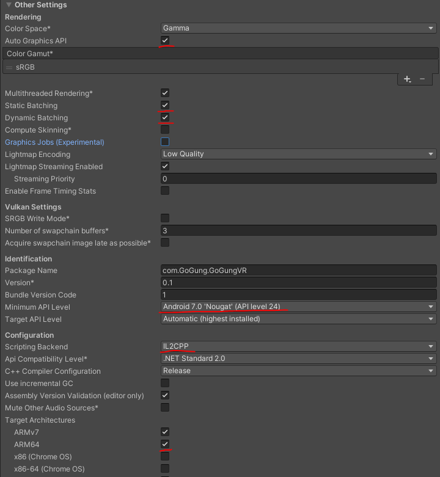
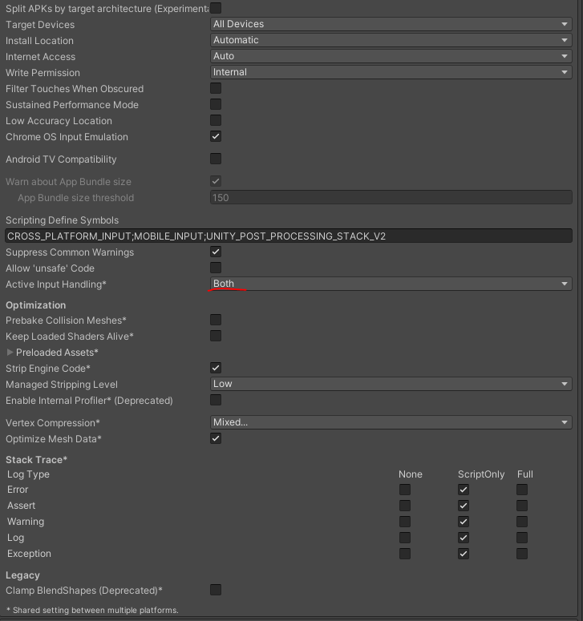
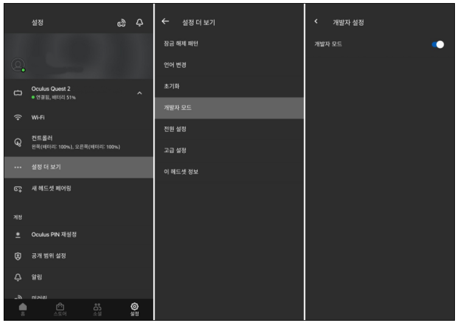

# **GoGung 포팅 메뉴얼**

**SSAFY 5기 특화프로젝트 서울 5반 1팀 GoGung**

> 박재준 박지우 이민아 한상길 한승희

 

------

# **📖 목차**

1️⃣ 개발 환경 세팅

2️⃣ 계정 정보

3️⃣ 빌드 및 배포 방법

4️⃣ 외부 서비스

 

------

## **🛠 개발 환경 세팅**

- Unity Personal
  - Unity 2019.4.31f1
    - Minimum API Level 24(Android 7.0 'Nougat')
  - Unity Plugins
    - Oculus XR Plugin 1.10.0
    - XR Interaction Toolkit 1.0.0-pre.2
    - XR Plugin Management 2.1.8
    - TextMeshPro 2.1.6
    - Visual Studio Editor 2.0.11
  - Visual Studio Community 2019
- 3D Object
  - SketchUp 2021
  - 3ds Max 2022
  - V-Ray for 3ds Max
  - Maya 2022
- Oculus Quest 2

 

## **🧑‍💻 계정 정보**

- 관리자ID : N/A
- 관리자PW : N/A
- 사용자ID : N/A
- 사용자PW : N/A
  - 어플리케이션 초기 실행 시 로그인 없이 바로 이용 가능

 

------

## **📢 빌드 및 배포 방법**

### **1. Unity 실행 가이드**

> Unity에서 직접 빌드 후 apk를 다운받아 이용

#### **(1) Unity 설치**

- [유니티 스토어 페이지에서 본인의 상황에 맞게 설치](https://store.unity.com/kr) 설치가 완료되면 **Unity Hub**가 설치됨

- Unity Hub 설치 완료 후 사용자 로그인 후 사용자 인증을 진행함

  Unity 유료 결제를 하지 않았다면 **Personal** 선택

- Unity hub에서 설티 탭을 클릭하고 추가 버튼을 눌러 **Unity 2019.4.31f1** 을 설치

  해당 항목이 없다면 설치 화면 상단에 존재하는 [Unity 다운로드 아카이브](https://unity3d.com/get-unity/download/archive) 에 접속해 해당 버전을 설치

- 설치 시 Platforms에서 **Android Build Suport** 설치

  놓쳤다면 Unity Hub에서 모듈 추가로 설치 가능 하지만 충돌 날 가능성이 높은 점 유의

#### (2) Player settings 빌드 환경 설정

- File > Build Settings 에서 Platform을 **Android**로 변경, 변경 후에 **Switch Platform** 클릭
- Window > Package Manager 에서 Packages: Unity Registry로 변경하고 **Oculus XR Plugin** 설치
- File > Build Settings > Player Settings 에서 좌측 항목중 XR Plug-in Management 클릭, Plug-in Providers 항목에서 Oculus 에 체크
- 다시 Player로 돌아가서 Other Settings에서 옵션 변경하기
  - Graphics APIs 에 **Vulkan**을 - 버튼으로 삭제
  - Identification항목에 Minimum API Level을 **7.0 Nougat** 버전으로 변경
  - Configuration에서 Scripting Backend를 Mono에서 IL2CPP로 변경
  - Target Architectures에서 ARM64에 체크
  - Active Input Handling* 에 **Both**로 변경

#### (3) 프로젝트 빌드

- File > Build Settings에서 빌드 혹은 `Ctrl + B` 로 apk 빌드

 

### **2. apk 실행 가이드**

> 외부에서 가져온 apk 파일을 Oculus 기기 자체에서 실행을 할 수 없으므로 Side Quest라는 프로그램을 이용

#### (1) Oculus Quest 등록

- 페이스북에 가입하고 휴대전화의 앱 스토어에서 Oculus를 검색하고 설치
- 휴대전화의 Oculus와 Oculus Quest 기기를 같이 킨 상태로 동기화(같은 와이파이 환경에 있어야 함)

#### (2) Oculus Quest 2

- 다음 링크로 이동하여 페이스북 계정을 개발자로 등록 [인증 - Oculus](https://dashboard.oculus.com/)
- 다음 순서로 Oculus 기기에서 개발자 모드 활성화

#### (3) Side Quest 설치

- 다음 링크에서 본인 PC의 OS에 맞는 Side Quest를 설치 [sidequestvr.com](https://sidequestvr.com/download)

#### (4) Oculus 기기 USB 디버깅 활성화

- PC와 Oculus 기기를 USB로 연결하기
- Oculus 기기 내에서 바로 팝업으로 뜨는 **USB 디버깅 활성화** 문구에 **'예'** 클릭
- PC와 Oculus 기기가 연결된 상태에서 Side Quest를 실행하여 왼쪽 상단에 연결이 잘 되었다는 의미의 초록 동그라미 확인

-16371329861901.png)

#### (5) apk 설치하기

- PC와 Oculus 기기가 잘 연결되어 있는 상태에서 Side Quest 프로그램에 apk 파일을 드래그
- 설치가 완료되면 Oculus 내의 앱 메뉴에서 오른쪽 상단의 **모두**를 클릭해 **알 수 없는 출처**로 변경
- 설치된 app을 실행

 

------

## **📡 외부 서비스**

- Google Translate TTS